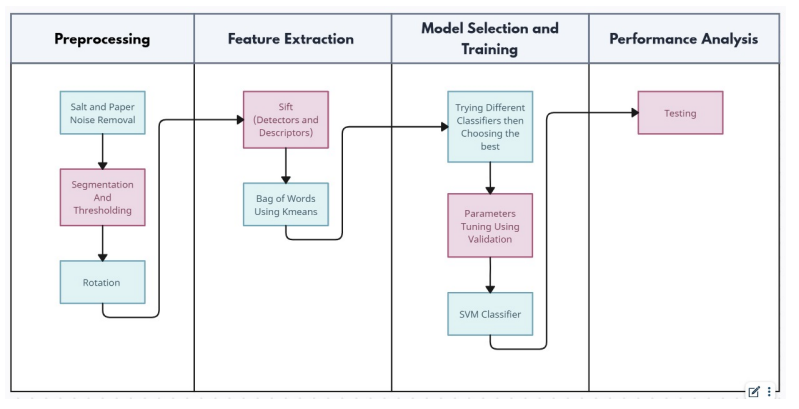

<h1 align='center'>Arabic Font Recognition</h1>

<div align="center">
   
</div>

This project focuses on implementing classical machine-learning approaches for Arabic font recognition. The aim is to develop a classification model capable of identifying various types of Arabic fonts. The model distinguishes between four specific fonts: Scheherazade New, Marhey, Lemonada, and IBM Plex Sans Arabic.
<h2>📝pipeline</h2>
<div align="center">
   
</div>

### 1. Preprocessing Module
- **Remove Salt & Pepper Noise**: Applied median blur to clean the image.
- **Segmentation**: Isolated text from the background and changed the background color to black.
- **Rotation**: Rotated the image using a 2D rotation matrix to align the text horizontally, followed by the warp function.

### 2. Feature Extraction/Selection Module
- **Papers Reviewed**:
  - **Arabic Font Recognition using Decision Trees Built from Common Words**: Implemented features like invariant moments, horizontal projection, and Walsh coefficients; achieved ~70% accuracy.
  - **Using Bag-of-Features for Arabic Font Recognition**: Applied the Bag-of-Features (BoF) framework; achieved ~99.5% accuracy.
  - **A Statistical Global Feature Extraction Method for Optical Font Recognition**: Implemented an eight neighboring kernel matrix for pixel relationship analysis.
  - **Optical Font Recognition Based on Global Texture Analysis**: Converted images into the frequency domain and extracted features like entropy, energy, kurtosis, and variance.

- **Final Approach**: Chose the second paper’s BoF method with SIFT for feature detection and description. Used K-means for clustering and histogram representation for model training.

### 3. Model Selection/Training Module
- **Classifiers Tested**:
  - K-Nearest Neighbors (KNN)
  - Support Vector Machines (SVM)
  - Random Forest
  - XGBoost

- **Final Model**: Selected SVM for its superior performance. Fine-tuned model parameters using the validation set for optimal generalization.

### 4. Performance Analysis Module
- **Data Split**:
  - Training Set: 60%
  - Validation Set: 20%
  - Test Set: 20%

- **Results**: Achieved an accuracy of 99.5% on the test set.
<div align="center">
   
</div>


<h2> 🖋️ Fonts Included:</h2>

- **Scheherazade New**
- **Marhey**
- **Lemonada**
- **IBM Plex Sans Arabic**


<h2>🔍 How to run</h2>
- to predict the font of an image on the server go to server_test.py change the varibale "image_path " to the path of the image then in the terminal run the following:

 ```bash
py  server_test.py
```
- to predict the font of an image locally go to predict.py then call the function make_prediction(img) 


<h2>💻 Built with</h2>

Technologies used in the project:


<div align="center">
	<code></code>
	<code></code>
	<code></code>
	<code></code>
</div>

<h2 align='center' <a name = "Contributors"> ⭐ Contributors ⭐ </h2>
<!-- readme: collaborators -start -->
<table  align='center'> 
<tr>
    <td align="center">
        <a href="https://github.com/yousefosama654">
            
            <br />
            <sub><b>Yousef</b></sub>
        </a>
    </td>
    <td align="center">
        <a href="https://github.com/EmanElbedwihy">
            
            <br />
            <sub><b>Eman</b></sub>
        </a>
    </td>
        <td align="center">
        <a href="https://github.com/nesma-shafie">
            
            <br />
            <sub><b>Nesma</b></sub>
        </a>
    </td>
    <td align="center">
        <a href="https://github.com/Sara-Gamal1">
            
            <br />
            <sub><b>Sara</b></sub>
        </a>
    </td></tr>
</table>
<!-- readme: collaborators -end -->
<h2 align='center'>Thank You. 💖 </h2>
